# BUNN ULTRA-2 Slushie Machine

## RECOMMENDED CLEANING

1. Turn cooling to OFF selection. Empty all product from the hopper(s). Turn auger to OFF selection. Disconnect the hopper lid lamp cord(s) and remove the lids.

2. Depress the hopper lock plunger. Lift the hopper up slightly.

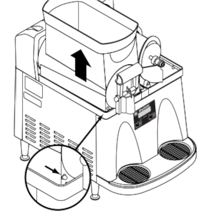

3. Pull the hopper forward to remove it.

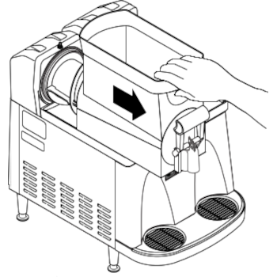

4. Pull the auger forward off of the cooling drum.

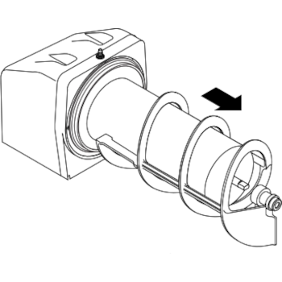

5. Remove the cooling drum seal from the rear of the drum.

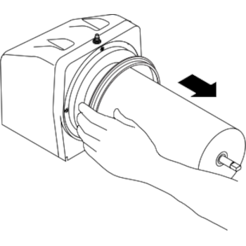

6. Caution: The faucet valve is under spring tension. Spread one side of the handle first, then the other and disconnect from the hopper.

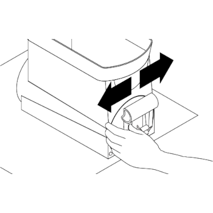

7. Carefully slide the faucet valve up to remove the spring and faucet seal. Extra care should be taken when handling the seal to prevent damage. Do not fold the seal as this will cause damage to the Teflon sealing surface.

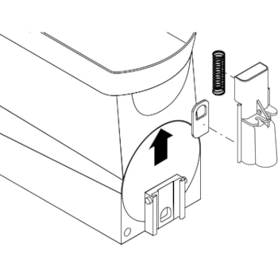

8. Remove the auger nose bushing from inside the hopper.

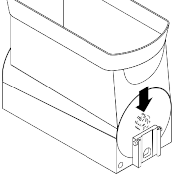

9. Care must be taken to ensure this surface does not get scratched during cleaning. Deep scratches could cause leakage around the seal.

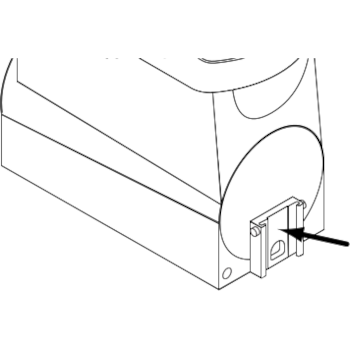

10. Place all parts in a clean sink with mild hot water (120°F) and sanitizer solution. Allow all parts to soak for at least 5 minutes. Carefully wash all components with a clean wash cloth in the hot water and sanitizer solution. Use a clean, soft bristle brush as needed for the smaller components and tight areas. Do not immerse hopper lids. Use a commercial sanitizer that has 100 ppm of available chlorine with a concentration level of at least 3% available chlorine (KAY-5 Sanitizer). Follow the sanitizer’s mixing instructions to ensure 100 ppm of available chlorine.

11. Wash the drums, hopper drip trays, top covers, and outer enclosure using a clean wash cloth that has been dampened in the hot water and sanitizer solution. Pay particular attention to the shaft area and make sure it is thoroughly cleaned and sanitized.

12. Thoroughly rinse all surfaces with a clean wash cloth that has been dampened with hot water. Wipe dry with a clean dry wash cloth before reassembling the dispenser.

* NOTE – Although most parts are dishwasher safe, they may be affected by the chemicals in some commercial sanitizing agents. Do not place the hopper nor hopper lids in a dishwasher. Rinse thoroughly before assembly

## ASSEMBLY FOLLOWING CLEANING

1. Install the seals over the flange at the rear of the cooling drums and press the seals firmly into place as shown.

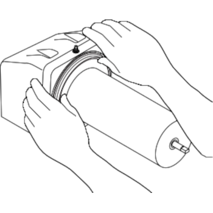

2. Align the auger shafts with the augers. Push the augers as far as they will go and rotate so the flat face of the auger shaft is aligned with the flat face of the auger nose.

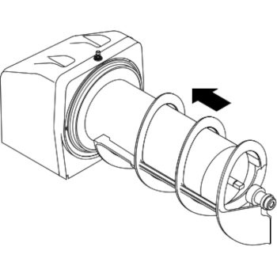

3. Install the auger nose bushing into the inside front of the hopper.

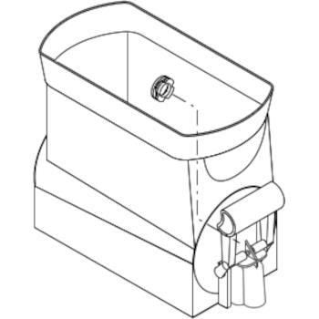

4. Thoroughly rinse the hoppers and install them over the augers and cooling drums.

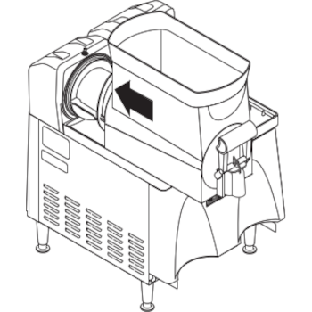

5. Slide the hopper into place and push down until the hopper lock plungers snap into place.

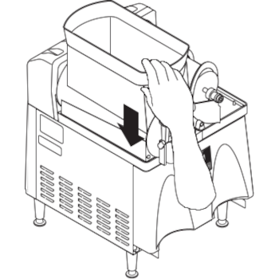

6. Set the lids on the hoppers and plug in the hopper lid lamp cords.

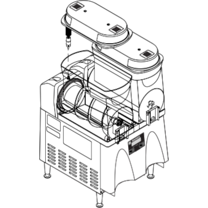

7. Position the faucet seal and return spring in the faucet valve.

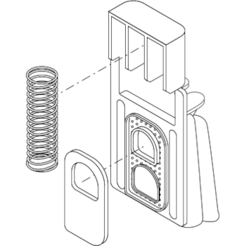

8. Slide the faucet valve assembly into place on the hopper.

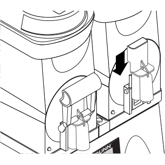

9. Press down on the valve to compress the spring. Position the faucet handle over the faucet valve one side at a time and snap into place on the hopper.

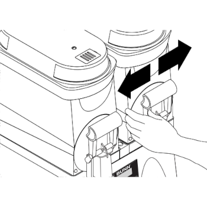

10. Assemble the drip tray.

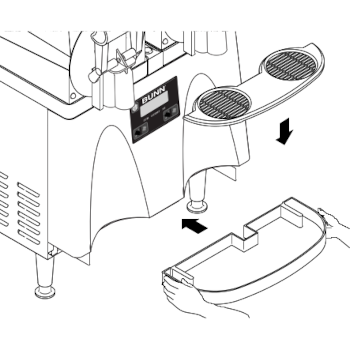

11. Turn ON augers and colling function to desired settings.