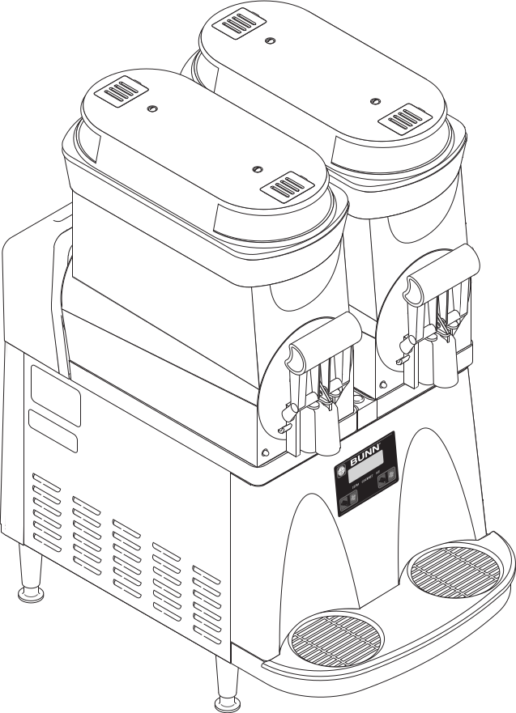
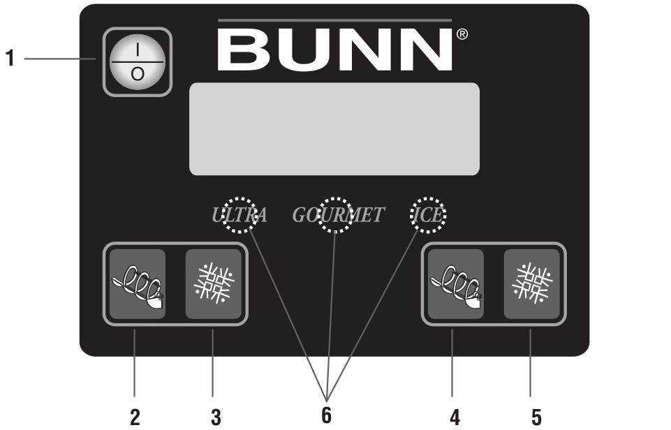

# BUNN ULTRA-2 Slushie Machine

As of Sumer 2021, this machine is currently located in the Bakery in the Main Barn.

All slushie machines must be disassembled, cleaned, and sanitized at least twice a week. Ideally this should be done at the end of the day with enough time for the machine to air dry and be reassembled and refilled before employees go home for the evening.

The information in this documentation comes from the [BUNN ULTRA-1 ULTRA-2 Installation & Operating Guide](files/manuals/Bunn_Operating_Manual.pdf).

## SECTIONS
* You Will Need:
* Diagrams
* Draining Product
* Disassembling Parts
* Cleaning & Sanitizing Parts
* Reassembling Parts
* Refilling Hoppers

## YOU WILL NEED:

* **large bucket** -- for use emptying product and rinsing the machine

* **Clean white dish towels** -- for wiping down the machine (located in the white laundry baskets)

* **Three Basin Sink with metered chemical dispensers** -- for cleaning and sanitizing the disassembled parts of the machine

## DIAGRAMS

### OPERATING CONTROLS

* There are 5 buttons used when operating the dispenser:

  1. 

    * This switch is the ON/OFF toggle switch which powers up the dispenser and the LCD display. When ON the Date and Time toggle back and forth continously except during programming.

  2. 

    * This is used to turn the left side auger motor to AUGER ON, or AUGER OFF.

  3. 

    * This is used to turn the left side ice control to OFF, ICE or CHILL.

  4. 

    * This is used to turn the right side auger motor to AUGER ON, or AUGER OFF.

  5. 

    * This is used to turn the right side ice control to OFF, ICE or CHILL.

  6. Hidden buttons used for Programming.

## DRAINING PRODUCT

1. Use the ICE button to select the OFF option.

2. Use the AUGER button to select the AUGER ON option (if the auger isn't on already).

2. Open the spigot and empty all product from the hoppers into a large bucket, then discard.

3. Once all product has drained out of the machine, use the AUGER button to select the AUGER OFF option.

## DISASSEMBLING PARTS

1. Disconnect the hopper lid lamp cord(s) and remove the lids.

2. Depress the hopper lock plunger. Lift the hopper up slightly.

3. Pull the hopper forward to remove it.

4. Pull the auger forward off of the cooling drum.

5. Remove the cooling drum seal from the rear of the drum.

6. Caution: The faucet valve is under spring tension. Spread one side of the handle first, then the other and disconnect from the hopper.

7. Carefully slide the faucet valve up to remove the spring and faucet seal. Extra care should be taken when handling the seal to prevent damage. Do not fold the seal as this will cause damage to the Teflon sealing surface.

8. Remove the auger nose bushing from inside the hopper.

9. Care must be taken to ensure this surface does not get scratched during cleaning. Deep scratches could cause leakage around the seal.

## CLEANING & SANITIZING PARTS

* Set up a three basin sink with the normal wash, rinse, and sanitization stations. The wash sink should be filled with FrontLine detergent from the metered dispenser, while the sanitization sink should be filled with Sanibet sanitizer, also from the metered dispenser.

* Carefully wash all disassembled parts in the sinks. Use a sponge or a clean, soft bristle brush as needed in order to clean the smaller components and tight areas.

* Once washed, sanitize the disassembled parts in the Sanibet sanitizing solution. Allow all parts to remain in the sanitizer for at least 5 minutes.

* Be careful not to immerse the hopper lid in water to avoid damaging the electronic components. Use a clean white rag and a bucket of red sanitizing solution to wipe the lid's surfaces clean, then use another clean rag to dry it.

* Use a clean white rag and a bucket of red sanitizing solution  wash the cooling drums, the hopper drip trays, and the exterior of the BUNN ULTRA-2 machine. Pay particular attention to the shaft area and make sure it is thoroughly cleaned and sanitized.

* Thoroughly rinse all surfaces with a clean wash cloth that has been dampened with hot water.

* Allow all parts time to air dry before reassembling the dispenser.

## REASSEMBLING PARTS

1. Install the seals over the flange at the rear of the cooling drums and press the seals firmly into place as shown.

2. Align the auger shafts with the augers. Push the augers as far as they will go and rotate so the flat face of the auger shaft is aligned with the flat face of the auger nose.

3. Install the auger nose bushing into the inside front of the hopper.

4. Thoroughly rinse the hoppers and install them over the augers and cooling drums.

5. Slide the hopper into place and push down until the hopper lock plungers snap into place.

6. Set the lids on the hoppers and plug in the hopper lid lamp cords.

7. Position the faucet seal and return spring in the faucet valve.

8. Slide the faucet valve assembly into place on the hopper.

9. Press down on the valve to compress the spring. Position the faucet handle over the faucet valve one side at a time and snap into place on the hopper.

10. Assemble the drip tray.

11. Turn ON augers and colling function to desired settings.

## REFILLING HOPPERS

* Lift the lid slightly for the selected hopper and slide it back to gain access to the hopper.

* Pour the pre-mixed liquid product into the hopper.

* Press and release the "POWER" (ON/OFF) button to power on the dispenser.

* Press and release the "AUGER" (ON/OFF) button to start the Auger Motor.

* Press and release the "ICE" (OFF/ICE/CHILL) button and select ICE to begin the cooling process for the selected hopper.

* Wait for the liquid to freeze to the desired consistency before serving.

* HINTS: Bunn-O-Matic recommends that the product in the dispenser be thawed each day, usually overnight. The ice granules get too large and a consistent product is difficult to maintain if left frozen for an extended period of time. Set the NIGHT mode for a few hours each night and return it to the DAY mode when the product has thawed sufficiently. You’ll know it is in the NIGHT mode because the display will indicate NIGHT MODE, and the hopper lights will turn off.