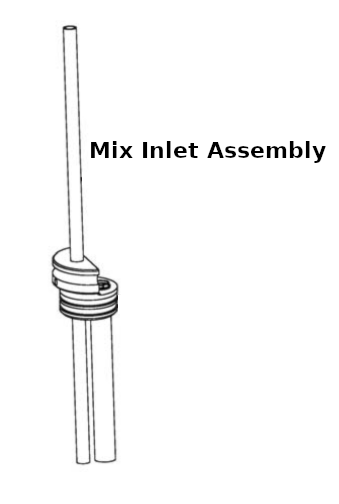

# STOELTING Model F231 Ice Cream Machine

As of Summer 2021, this machine is currently located in [Shakes & Cakes](https://github.com/marshall-strong/wickham/wiki/Shakes-&-Cakes) in the [Food Barn](https://github.com/marshall-strong/wickham/wiki/Shakes-&-Cakes).

[The information in this documentation is taken primarily from the anual for STOELTING Model F231 Service Manual.](../../files/manuals/stoelting_f231_service_manual.pdf)

All ice cream machines must be disassembled, cleaned, and sanitized at least twice a week. Ideally this should be done at the end of the day with enough time for the machine to air dry and be reassembled and refilled before employees go home for the evening.

## SECTIONS
* [You Will Need:](https://github.com/marshall-strong/wickham/wiki/STOELTING-Model-F231-Ice-Cream-Machine#you-will-need)
* [Draining Product](https://github.com/marshall-strong/wickham/wiki/STOELTING-Model-F231-Ice-Cream-Machine#draining-product)
* [Rinsing](https://github.com/marshall-strong/wickham/wiki/STOELTING-Model-F231-Ice-Cream-Machine#rinsing-hoppers)
* [Sanitizing](https://github.com/marshall-strong/wickham/wiki/STOELTING-Model-F231-Ice-Cream-Machine#sanitizing-hoppers)
* [Disassembling](https://github.com/marshall-strong/wickham/wiki/STOELTING-Model-F231-Ice-Cream-Machine#disassembling)
* [Cleaning](https://github.com/marshall-strong/wickham/wiki/STOELTING-Model-F231-Ice-Cream-Machine#cleaning)
* [Reassembling](https://github.com/marshall-strong/wickham/wiki/STOELTING-Model-F231-Ice-Cream-Machine#reassembling)
* [Refilling](https://github.com/marshall-strong/wickham/wiki/STOELTING-Model-F231-Ice-Cream-Machine#refilling)

## YOU WILL NEED:

* **32 quart plastic container** -- for draining any remaining ice cream out of the machine before cleaning it (stored upstairs in the Main Barn)
* **8 quart red sanitizer bucket (the larger size)** -- for pouring water into machine and for mixing Stera Sheen sanitizer (stored in the Food Barn kitchens)
* **Stera Sheen Green Label Sanitizer & Cleaner (Milkstone Remover)** -- for sanitizing the inside of the machine (located in the Food Barn chemical closet)
* **Clean white dish towels** -- for use with the Stera Sheen sanitizing solution and for wiping down the machine (located in the white laundry baskets)
* **Three Basin Sink with metered chemical dispensers** -- for cleaning and sanitizing the disassembled parts of the machine
* **Petrol-Gel Sanitary Lubricant** -- for lubricating parts when reassembling the machine (located in the Food Barn chemical closet)

## DIAGRAMS

## DRAINING PRODUCT

All ice cream mix must be emptied out of the machines before they can be cleaned. To avoid waste, extra ice cream is drained into 32 quart containers and frozen for later in the walk-in freezer. 32 quart plastic containers are stored upstairs in the Main Barn.

**Repeat these steps for each of the machine's two hoppers/freezing cylinders**

1. Ice cream in the machine at the time of cleaning should be drained into a 32 quart plastic container. Open the spigot on the machine like you normally would, and fill 32 quart containers until the ice cream stops flowing readily. Full 32 quart containers should be stored in the walk-in freezer by the Shop or in the Food Barn freezer.

2. Once the ice cream is no longer flowing readily, stop filling the 32 quart containers. Open the lid of the hopper and remove the mix inlet assembly (see diagram). Set it aside to be cleaned later.

3. Press the CLEAN button. This will start a 5 minute cleaning cycle where the auger spins to help melt any ice cream mix still in the machine. Let the machine run for the entire 5 minute cycle.

4. The CLEAN cycle should stop automatically after 5 minutes. Open the spigots and drain any remaining ice cream mix into the 8 quart red plastic sanitizer bucket. Discard the ice cream mix in the three basin sink, then rinse out the red plastic sanitizer bucket.

## RINSING HOPPERS

Before the machine can be properly cleaned and sanitized, all ice cream mix remaining in the hoppers and freezing cylinders must be flushed out with water.

**Repeat these steps for each of the machine's two hoppers/freezing cylinders**

1. Fill the red plastic bucket with 8 quarts (2 gallons) of cool tap water.

2. Pour the water into the hopper, then press the CLEAN button to initiate a 5 minute cleaning cycle.

3. While the CLEAN cycle is running, use a brush or rag to clean off any ice cream that is stuck to the sides of the hopper.

4. Once the CLEAN cycle ends, open the spigots and drain all of the water out of the hopper and into the red plastic bucket.

5. If the water flowing out of the hopper is not clear, repeat steps 1-5 as many times as necessary until the water draining into the bucket is no longer milky.

6. If a hopper needs another CLEAN cycle run but the machine says 'MAXIMUM CLEANING TIME REACHED', try turning the hopper off and on again.

## SANITIZING HOPPERS

When sanitizing the inside of the ice cream machine, it is important to use the **Stera Sheen Green Label Sanitizer & Cleaner (Milkstone Remover)** and **NOT** the normal Sanibet sanitizer that is dispensed at the three basin sinks. The dairy in ice cream mix causes mineral salts to build up in our ice cream machines -- these mineral deposits are called milkstone, and they require a special chemical in order to be removed (hence the Stera Sheen).

**Repeat these steps for each of the machine's two hoppers/freezing cylinders**

1. Fill a large red sanitizer bucket with 8 quarts of hot water, then add one 2 oz. scoop of Stera-Sheen sanitizing mix and stir.

2. Pour the sanitizer solution into the hopper.

3. Press the CLEAN button to start the auger in the freezing cylinder.

4. While the CLEAN cycle is running, use a sponge or rag to wipe down the inside walls of the hopper to make sure that all ice cream mix is removed and that the solution sanitizes the entire hopper. Make sure to get around the mix level probe.

5. Once the CLEAN cycle stops after 5 minutes, open the spigots and drain the sanitizing solution back into the 8 quart red bucket.

6. Once the solution has drained, press the CLEAN button to stop the auger. Place the red bucket back under the spigot and allow any remaining water in the freezing cylinder to drain completely.

7. Wash the hopper lid in the dishwasher. As soon as the lid is dry, recover the hopper to prevent any contaminates from falling into the freshly sanitized hopper.

## DISASSEMBLING

### Disassembling the Front Door

1. Turn the machine off by pressing the Power Off/On button.

2. Remove the 4 black knobs holding the front door in place.

3. Remove the front door assembly by pulling it forward off of the studs.

4. Remove the spigots from the front door assembly by pushing them up through the holes in the bottom of the door.

5. Remove all o-rings from the parts by first wiping the lubrication off with a towel, then rolling the o-ring out of its groove.

### Disassembling the Augers

**Repeat these steps for each of the machine's two hoppers/freezing cylinders**

1. Remove the front auger support and bushing.

2. Remove the auger assembly from the machine. Pull the auger out of the machine barrel slowly. As the auger is being pulled out, carefully remove each of the plastic flights with springs.

3. Once the auger is out, remove the rear seal from the other end of the auger.

## CLEANING

1. Use a three basin sink to wash, rinse, and sanitize the disassembled parts the same way you would any other dirty dishes. The normal Sanibet sanitizer from the 3 basin sinks can be used to sanitize the disassembled parts, but parts must remain in the sanitizer for at least 5 minutes, and all parts must be allowed to air dry before the machine can be reassembled.

2. Remove the drip tray, wash, rinse, and sanitize it in the three basin sinks, then allow it to air dry.

3. Fill a large red sanitizer bucket with 8 quarts of hot water, then add one 2 oz. scoop of Stera-Sheen sanitizing mix and stir.

4. Use the Stera-Sheen sanitizing solution and a clean dish towel to wipe down and sanitize the inside of the freezing cylinder.

5. Use the Stera-Sheen sanitizing solution and a clean dish towel to wipe down all exterior surfaces of the ice cream machine.

6. Use a clean, dry towel to wipe the exterior of the machine dry.

## REASSEMBLING

Ideally, ice cream machines should be reassembled and refilled the same day they are cleaned and sanitized, after the ice cream machine and the disassembled parts have been given time to air dry. This will give the ice cream time to freeze overnight.

1. Roll all o-rings onto their parts dry, without any lubrication. Once each o-ring is in the right place, apply a thin film of sanitary lubricant to the exposed surface of the o-ring.

2. Lubricate the rear seal area on the auger shaft with a thin layer of sanitary lubricant. Install the rear seal o-ring. Lubricate the outside of the rear seal o-ring with sanitary lubricant.

3. Lubricate the inside metal surface of the rear seal and install it onto the auger shaft. DO NOT lubricate the outside of the rear auger seal.

4. Lubricate the hex drive end of the auger with a small amount of lubricant.

5. Screw the springs onto the studs in the plastic flights. The springs must be screwed into the flights completely to provide proper compression.

6. Install the two plastic flights onto the rear of the auger and insert it part way into the freezing cylinder.

7. Install the two remaining plastic flights, push the auger into the freezing cylinder, and rotate slowly until the auger engages the drive shaft.

8. Apply a thin layer of sanitary lubricant to the inside and outside of the auger support bushing. Install the bushing onto the auger support and install the auger support into the front of the auger. Rotate the auger support so that one leg of the support points straight up.

9. Apply a thin layer of sanitary lubricant to the o-rings on the spigot body and install the spigot body through the bottom of the front door.

10. Apply a thin film of sanitary lubricant to the door seal o-ring and fit it into the groove on the rear of the front door.

11. Place the front door assembly on the mounting studs and the push front door against the machine carefully.

12. Secure the front door to the machine by placing the knobs on the studs and tightening until finger tight. Do not overtighten. A proper o-ring seal can be observed through the transparent front door.

13. Insert the Mix Inlet Assembly back into its hole in the bottom of the hopper.

## REFILLING

1. Only refill the ice cream machine once it has been properly cleaned, sanitized, allowed to air dry, and reassembled.

2. Make sure the display shows the freezing cylinder is off. If it is not, press the On/Off Left or On/Off Right button to turn it off.

3. Fill the hopper with at least 2.5 gallons of soft-serve ice cream mix.

4. Place a container under the spigot and open the spigot to drain ~8 oz. of mix out of the machine. This will allow the ice cream mix to flush out any sanitizing solution that may still remain in the machine.

5. Press the On/Off button to turn on the freezing cylinder.

6. Press the PUSH TO FREEZE button.

7. Once the ice cream in the machine is at 75% consistency, the display will change to read "SERVE". At this point you may open the spigot and begin to dispense product.

''
