# TAYLOR Model 8754 Ice Cream Machine

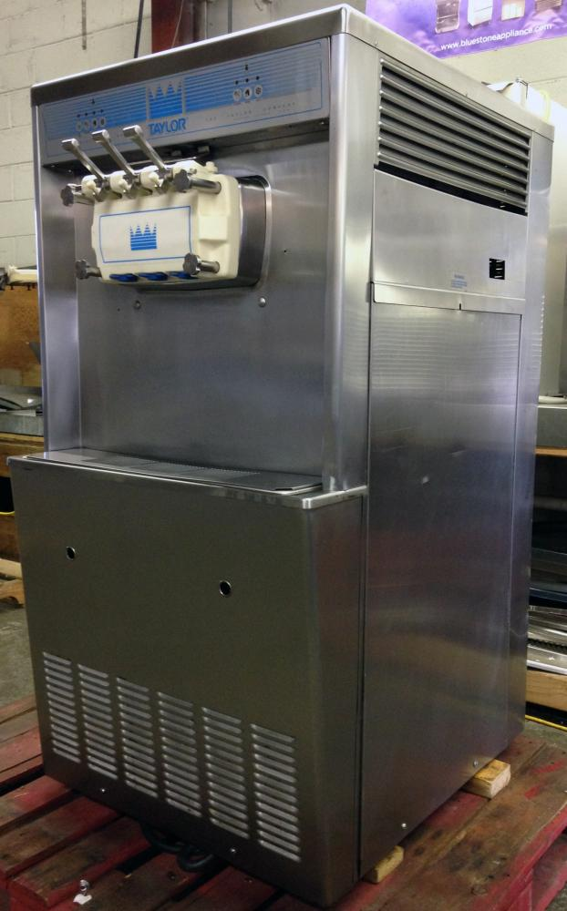

As of Sumer 2021, this machine is currently located in the Bakery in the Main Barn.

All ice cream machines must be disassembled, cleaned, and sanitized at least twice a week. Ideally this should be done at the end of the day with enough time for the machine to air dry and be reassembled and refilled before employees go home for the evening.

## SECTIONS
* You Will Need:
* Draining Product
* Rinsing
* Sanitizing
* Disassembling
* Cleaning
* Reassembling
* Refilling

## YOU WILL NEED:

* **32 quart plastic container** -- for draining any remaining ice cream out of the machine before cleaning it (stored upstairs in the Main Barn)

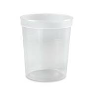

* **8 quart red sanitizer bucket (the larger size)** -- for pouring water into machine and for mixing Stera Sheen sanitizer (stored in the Food Barn kitchens)

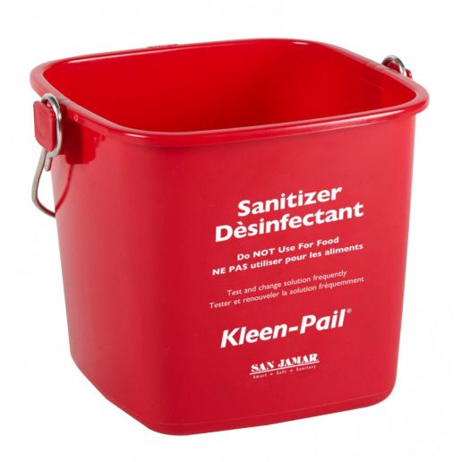

* **Stera Sheen Green Label Sanitizer & Cleaner (Milkstone Remover)** -- for sanitizing the inside of the machine (located in the Food Barn chemical closet)

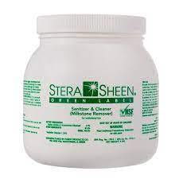

* **Clean white dish towels** -- for use with the Stera Sheen sanitizing solution and for wiping down the machine (located in the white laundry baskets)

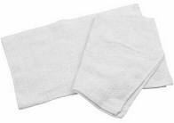

* **Three Basin Sink with metered chemical dispensers** -- for cleaning and sanitizing the disassembled parts of the machine

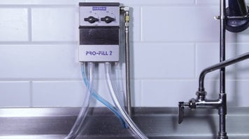

* **Petrol-Gel Sanitary Lubricant** -- for lubricating parts when reassembling the machine (located in the Food Barn chemical closet)

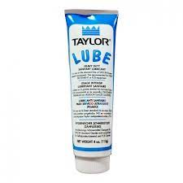

## DIAGRAMS

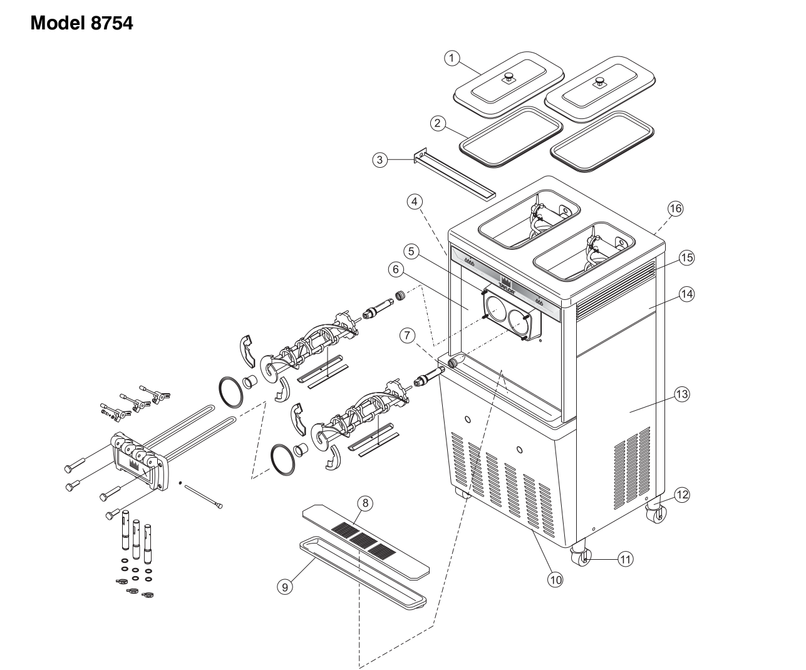

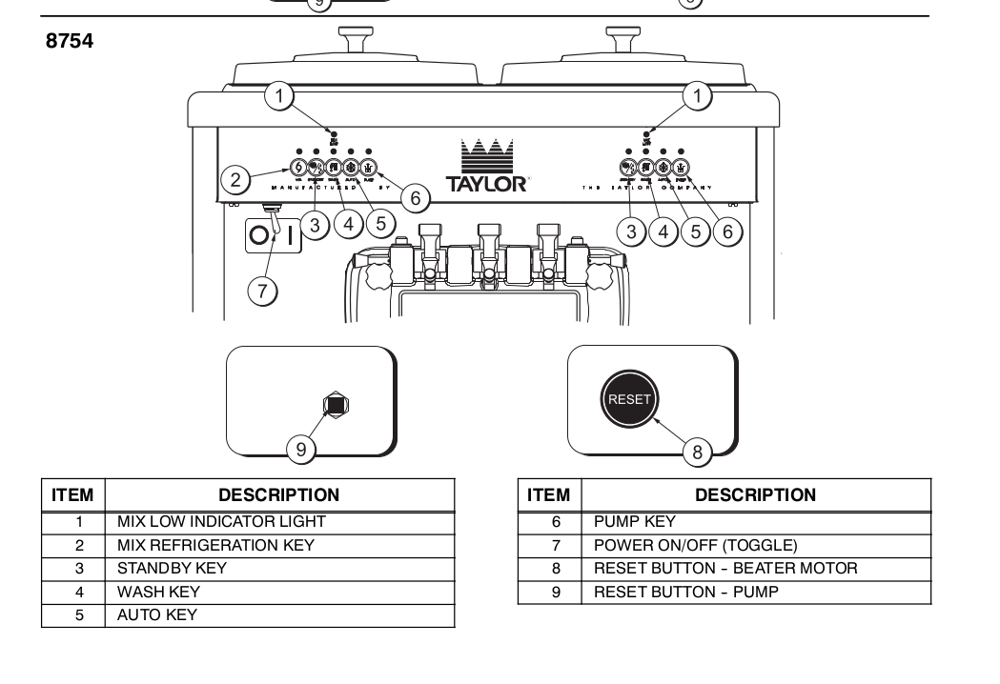

## DRAINING PRODUCT

All ice cream mix must be emptied out of the machines before they can be cleaned. To avoid waste, extra ice cream is drained into 32 quart containers and frozen for later in the walk-in freezer. 32 quart plastic containers are stored upstairs in the Main Barn.

**Repeat these steps for each of the machine's two hoppers/freezing cylinders**

* Ice cream in the machine at the time of cleaning should be drained into a 32 quart plastic container. Open the spigot on the machine like you normally would, and fill 32 quart containers until the ice cream stops flowing readily. Once filled, 32 quart containers should be stored in the walk-in freezer by the Shop or in the Food Barn freezer. Stop filling 32 quart containers once the ice cream is no longer flowing readily.

* Press the AUTO button to stop the compressor and the beater motor.

* Press the MIX REF button to shut off the hopper's mix refrigeration system.

* Remove the hopper cover and gasket. Take these parts to the sink for cleaning.

* Place the red bucket below the hopper's spout, then press the WASH and PUMP buttons.

6. Pull down on the draw handle to drain the remaining ice cream mix out of the hopper and freezing cylinder and into the red bucket. When the flow of ice cream mix stops, close the draw valve and press the WASH and PUMP buttons.

## RINSING HOPPERS

Before the machine can be properly cleaned and sanitized, all ice cream mix remaining in the hoppers and freezing cylinders must be flushed out with water.

**Repeat these steps for each of the machine's two hoppers/freezing cylinders**

1. Fill the red plastic bucket with 8 quarts (2 gallons) of cool tap water.

2. Pour the water into the hopper, then press the WASH button for the hopper you are working on. This will initiate a cleaning cycle where the auger spins to help melt any ice cream mix still in the machine.

3. While the WASH cycle is running, use a brush or rag to clean off any ice cream that is stuck to the sides of the hopper, the mix inlet hole, and the mix level sensing probe.

4. After a few minutes, open the spigot and drain the water into the 8 quart red plastic sanitizer bucket. Once the water has stopped flowing, press the WASH button to turn off the auger. Discard the water in the three basin sink, then rinse out the red plastic sanitizer bucket.

5. If the water flowing out of the hopper is not clear, repeat steps 1-5 as many times as necessary until the water draining into the bucket is no longer milky.

## SANITIZING HOPPERS

When sanitizing the inside of the ice cream machine, it is important to use the **Stera Sheen Green Label Sanitizer & Cleaner (Milkstone Remover)** and **NOT** the normal Sanibet sanitizer that is dispensed at the three basin sinks. The dairy in ice cream mix causes mineral salts to build up in our ice cream machines -- these mineral deposits are called milkstone, and they require a special chemical in order to be removed (hence the Stera Sheen).

**Repeat these steps for each of the machine's two hoppers/freezing cylinders**

* Fill a large red sanitizer bucket with 8 quarts of hot water, then add one 2 oz. scoop of Stera-Sheen sanitizing mix and stir.

* Pour the two gallons of sanitizing solution into the hopper and allow it to flow into the freezing cylinder.

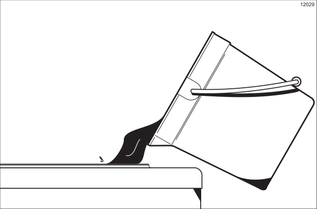

* While the sanitizing solution is flowing into the freezing cylinder, take particular care to brush-clean the mix level sensing probe on the front wall and the bottom of the hopper, the mix inlet hole, and the walls of the mix hopper. Use a brush or clean white rag.

* Place the power switch in the ON position.

* Press the WASH button. This will cause the sanitizing solution in the freezing cylinder to agitate. Allow it to agitate for five minutes.

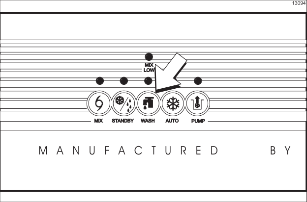

* With an empty pail beneath the door spouts, raise the prime plug and press the PUMP key.

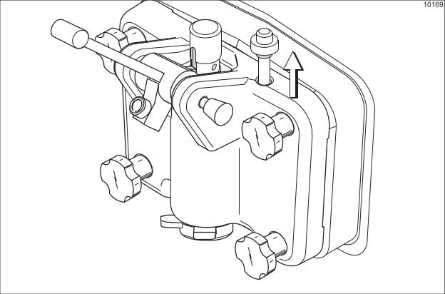

* When a steady stream of sanitizing solution is flowing from the prime plug opening in the bottom of the freezer door, pull the draw handle down. On the Model 8754, momentarily pull the center draw handle down to sanitize the center door spout. Draw off all of the sanitizing solution.

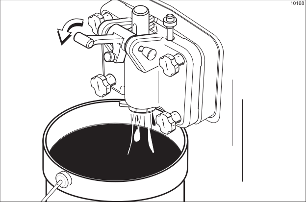

* Once the sanitizer stops flowing from the door spouts, raise the draw handles. Press the WASH and PUMP keys, cancelling the beater motor and pump operation.

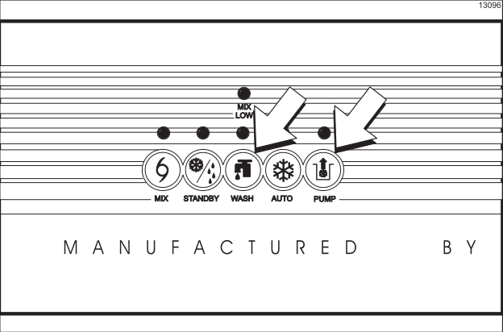

* Assemble the hopper gasket around the top edge of the mix hopper.

## DISASSEMBLING

Pro Tip: When taking the machine apart for cleaning, keep the disassembled parts in one of the dishwasher racks (the kind without pegs) to avoid losing any.

1. Flip the power switch to the OFF position. Ensure that no lights are lit on the control panel.

2. Remove the front drip tray and the splash shield, and take to the sink for cleaning.

3. Unscrew the four knobs/hand-screws that hold the freezer door assembly in place.

4. Remove the freezer door assembly by pulling it forward off of the studs, and take it to the sink for cleaning.

5. Remove the beaters, beater shoes, scraper blades, and drive shafts from inside the freezing cylinders, and take them to the sink for cleaning.

6. Remove the drive shafts from the drive hubs in the rear wall of the mix hoppers and take to the sink for cleaning.

7. Remove any design caps from the ends of the door spouts.

8. Remove the long pivot pin from the freezer door assembly that holds the three draw handles in place.

9. Remove the three metal draw handles by pulling them out of the slots in the three draw valves.

10. Remove the three draw valves (one for each handle) by pushing them DOWN and out of the front assembly.

11. Remove the two prime plugs (one for each freezing cylinder) by pulling them UP and out of the top of the front assembly.

12. The freezer door assembly has two sets of baffle rods that protrude out the back of the assembly; one set for each freezing cylinder. Slide each of the white plastic bearings off the ends of the baffle rods.

13. Remove the two large black rubber gaskets (big o-rings) from their grooves on the back side of the freezer door assembly.

## CLEANING

1. Set up a three basin sink with the normal wash, rinse, and sanitize stations. The normal Sanibet Sanitizer that is dispensed from the sink is fine (no need to to use the Stera Sheen Sanitizer this time).

2. Use a sponge to wash all of the disassembled parts in the 3 basin sink. Make sure to remove all lubricant from the o-rings and their parts.

3. Sanitize the disassembled parts in the Sanibet Sanitizer. They must remain in the solution for at least 5 minutes, then be allowed to air dry. All parts must be fully dry before the machine can be reassembled.

4. Fill a large red sanitizer bucket with 8 quarts of hot water, then add one 2 oz. scoop of Stera-Sheen sanitizing mix and stir to create Stera-Sheen sanitizing soluiton.

5. Use the Stera-Sheen sanitizing solution and a clean dish towel to wipe down and sanitize the inside of the freezing cylinder.

6. Use the Stera-Sheen sanitizing solution and a clean dish towel to wipe down all exterior surfaces of the ice cream machine.

7. Use a clean, dry towel to wipe the exterior of the machine dry.

## REASSEMBLING

Ideally, ice cream machines should be reassembled and refilled the same day they are cleaned and sanitized, after the ice cream machine and the disassembled parts have been given time to air dry. This will give the ice cream time to freeze overnight.

**Repeat Step 1 and Step 2 for each of the machine's two hoppers/freezing cylinders**

1. Step 1: Install the drive shaft.

* To install the drive shaft, lubricate the groove and shaft portion that comes in contact with the bearing on the beater drive shaft. Slide the seal over the shaft and groove until it snaps into place. Do NOT lubricate the hex end of the drive shaft. Fill the inside portion of the seal with 1/4" more lubricant and lubricate the flat side of the seal that fits onto the rear shell bearing.

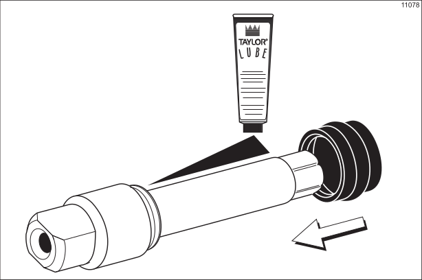

* Insert the drive shaft into the freezing cylinder, hex end first, and into the rear shell bearing until the seal fits securely over the rear shell bearing. Engage the hex end firmly into the drive coupling. Be sure the drive shaft fits into the drive coupling without binding.

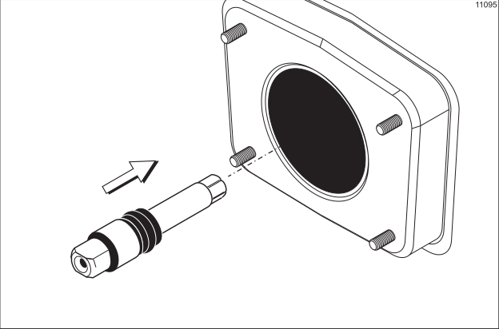

2. Step 2: Install the beater assembly.

* First check the scraper blades for any nicks or signs of wear. If any nicks are present, or if the blades are worn, replace both blades. If the blades are in good condition, install the scraper blade clips on the scraper blades. Place the rear scraper blade over the rear holding pin on the beater. Note: The hole on the scraper blade must fit securely over the pin to prevent costly damage.

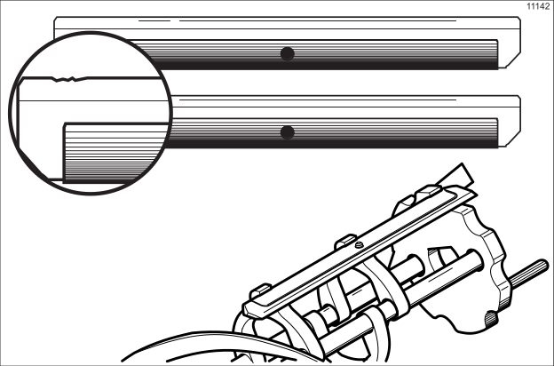

* Holding the rear blade on the beater, slide it halfway into the freezing cylinder. Install the front scraper blade over the front holding pin.

* Install the beater shoes.

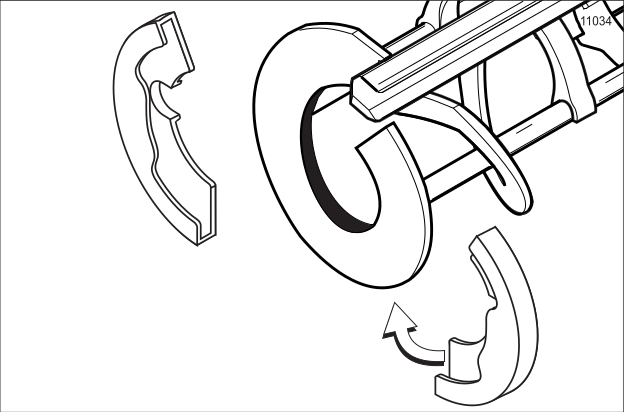

* Slide the beater assembly the rest of the way into the freezing cylinder.

* Make sure the beater assembly is in position over the drive shaft. Turn the beater slightly to be certain that the beater is properly seated. When in position, the beater will not protrude beyond the front of the freezing cylinder.

3. Step 3: Assemble the freezer door.

* Place the large rubber gaskets into the grooves on the back side of the freezer door. Slide the white plastic front bearings over the baffle rods onto the bearing hubs making certain that the flanged end of the bearing is resting against the freezer door. DO NOT LUBRICATE THE GASKET(S) OR THE FRONT BEARING(S).

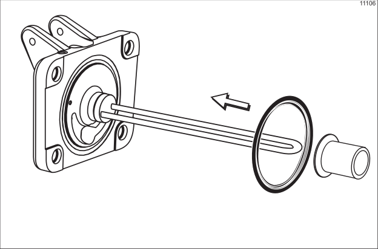

* Note that there are two gaskets and two front bearings for the Model 8754 door, one for each freezing cylinder.

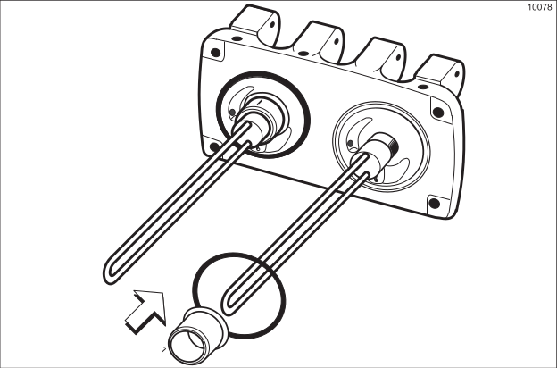

* Slide the two o-rings into the grooves on the prime plugs. Apply an even coat of Taylor Lube to the o-rings and shafts.

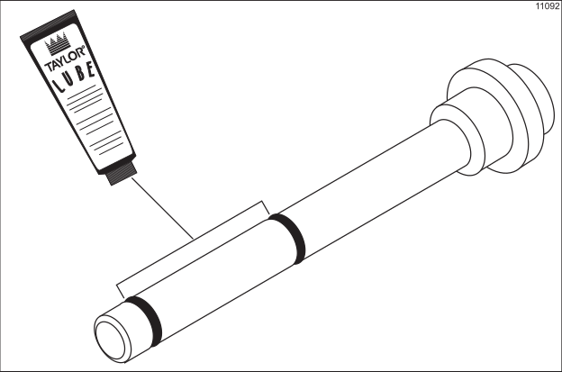

* Note that there are two prime plugs for the Model 8754 door, one for each freezing cylinder (pictures may only display a single freezing cylinder).

* Insert the prime plugs into the holes in the top of the freezer door, and push down.

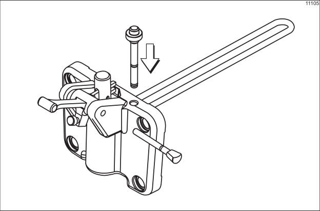

4. Step 4: Install the freezer door.

* Insert the baffle rods through the opening in the beaters and seat the door flush with the freezing cylinder. With the door seated on the freezer studs, install the handscrews. Tighten equally in a crisscross pattern to insure the door is snug.

* Note that on the Model 8754, the short handscrews go on the bottom and the long handscrews go on the top.

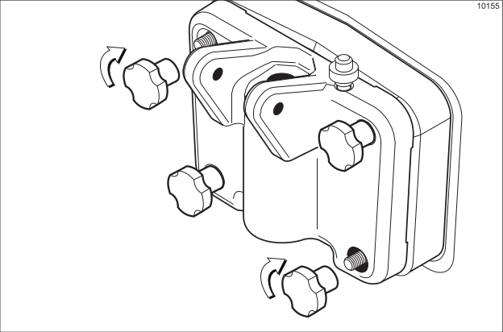

5. Step 5: Install the draw valves.

* Slide the two o-rings into the grooves on the draw valves, and lubricate. Note that the Model 8754 has three draw valves.

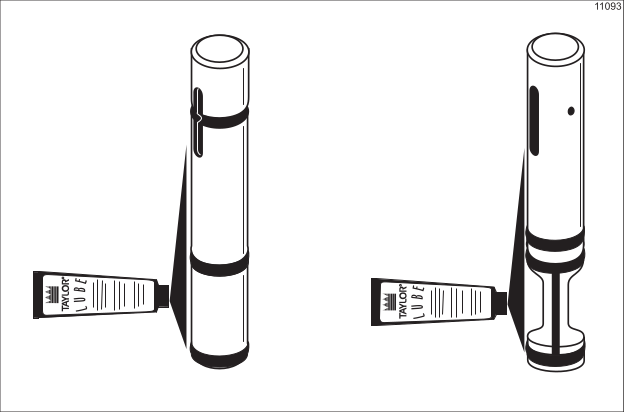

* Lubricate the inside of the freezer door spouts, top and bottom, and insert the draw valves from the bottom until the slot in the draw valves comes into view.

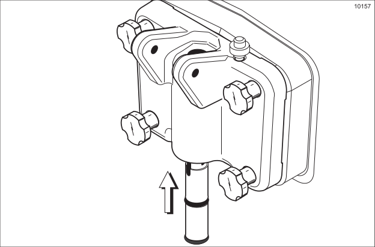

6. Step 6: Install the draw handles.

* Install the adjustable draw handles. Slide the o-ring into the groove on the pivot pin, and lubricate.

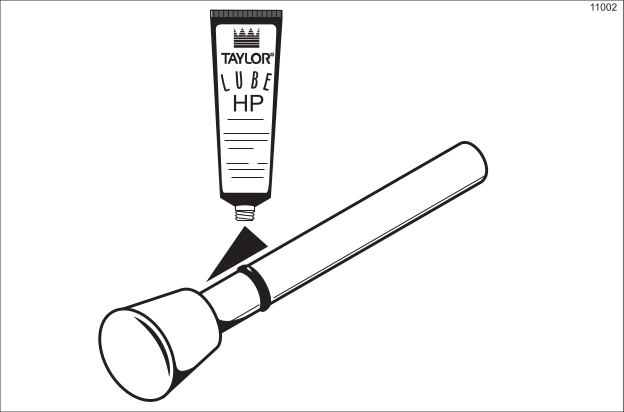

* Note that the Model 8754 has three draw handles. Slide the fork of the draw handle in the slot of the draw valve, starting from the right. Slide the pivot pin through each draw handle as you insert them into the draw valves.

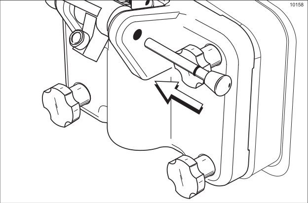

7. Step 7: Install the design caps.

* Snap the design caps over the end of the door spouts.

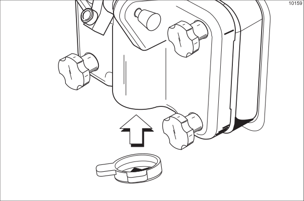

8. Step 8: Install the front drip tray and splash shield.

* Install the front drip tray and the splash shield under the door spouts.

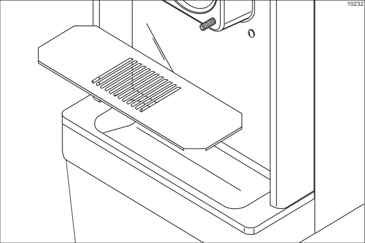

9. Step 9: Install the rear drip pan.

* Slide the rear drip pan into the hole in the side panel.

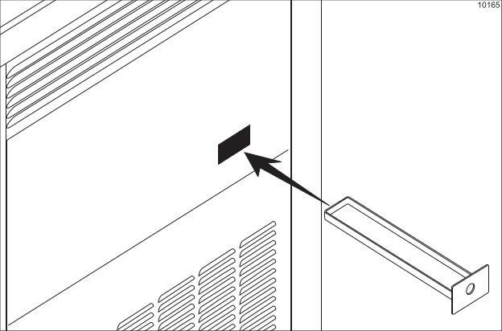

## REFILLING

* Place an empty pail beneath the door spout and lower the draw handle. Be sure the prime plug is still in the UP position. Pour two gallons of fresh mix into the hopper and allow it to flow into the freezing cylinder. This will force out any remaining sanitizing solution. When full strength mix is flowing from the door spout, raise the draw handle.

* Once a steady stream of mix starts to flow from the prime plug opening in the bottom of the freezer door, push down the prime plug.

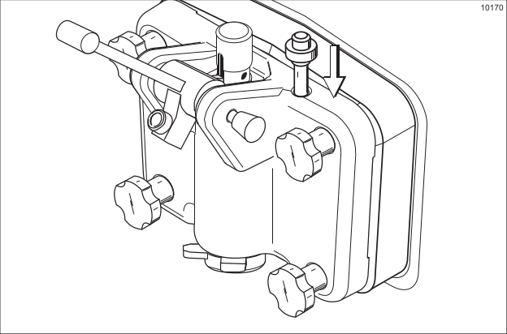

* Press the AUTO button. When the unit cycles off, the product will be at serving viscosity.

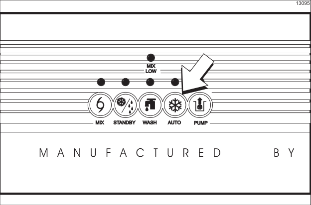

* Fill the hopper with fresh mix. As the mix level comes in contact with the mix level sensing probe on the front wall of the hopper, the MIX LOW light will shut off.

* Note: The MIX REF light will come on, indicating the mix refrigeration system is maintaining mix in the mix hopper.

* Place the washed and dried lid to the hopper back in position.