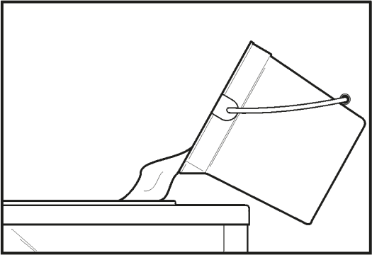
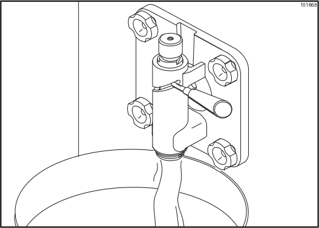
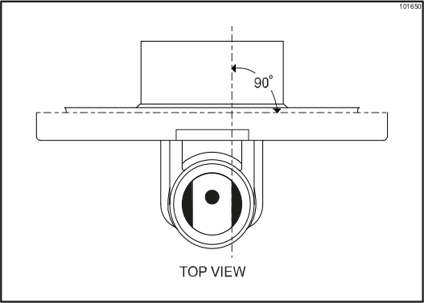
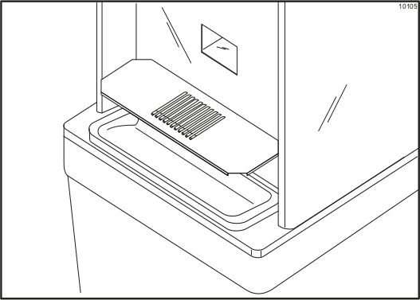

# TAYLOR Model 342 Slushie Machine

As of Sumer 2021, this slushie machine is currently located in **Shakes & Cakes** in the **Food Barn**.

All slushie machines must be disassembled, cleaned, and sanitized at least twice a week. Ideally this should be done at the end of the day with enough time for the machine to air dry and be reassembled and refilled before employees go home for the evening.

The information in this documentation comes from the [TAYLOR Operator's Manual for Model 340, 341, 342 Slush Freezers](files/manuals/taylor_340_341_342_manual.pdf).

# SECTIONS
* You Will Need:
* Diagrams
* Draining Product
* Rinsing Hoppers
* Sanitizing Hoppers
* Disassembling Parts
* Cleaning & Sanitizing Parts
* Reassembling Parts
* Refilling Hoppers

# YOU WILL NEED:

* **large bucket** -- for use emptying product and rinsing the machine

* **Clean white dish towels** -- for wiping down the machine (located in the white laundry baskets)

* **Three Basin Sink with metered chemical dispensers** -- for cleaning and sanitizing the disassembled parts of the machine

# DIAGRAMS

# DRAINING PRODUCT

1. Place the control switch in the OFF position as far ahead of cleaning time as possible to allow frozen product to soften for easier cleaning.

2. Remove the hopper cover, hopper gasket, and air tube. Take these parts to the sink for cleaning.

# RINSING HOPPERS

1. Pour 2 gallons of cool, clean water into the mix hopper. With the brushes provided, scrub the sides of the mix hopper, the mix inlet hole, and the mix-level sensing probe.

2. With a pail beneath the door spout, place the control switch in the WASH position and move the draw handle to the right. Drain all the rinse water from the freezing cylinder. When the rinse water stops flowing from the door spout, move the draw handle to the left and place the control switch in the OFF position. Repeat this procedure until the rinse water being drawn from the freezing cylinder is clear.

# SANITIZING HOPPERS

* Lay the hopper gasket and feed tube in the bottom of the mix hopper so that they can all be sanitized at the same time.

* Fill a bucket with 2.5 gallons of Sanibet sanitizing solution from a metered sink dispenser. Use warm water.

* Pour the sanitizing solution into the hopper and allow it to flow into the freezing cylinder.

* While the solution is flowing into the freezing cylinder, use a brush to clean the mix hopper, the mix inlet hole, the air tube, and the mix-level sensing probe.

* Place the control switch in the WASH position. This will cause the cleaning solution in the freezing cylinder to agitate. Allow the solution to agitate for 5 minutes.

* Place an empty pail beneath the door spout and move the draw handle to the right. Draw off all of the cleaning solution. When the solution stops flowing from the door spout, move the draw handle to the left and place the control switch in the OFF position.

# DISASSEMBLING PARTS

* WARNING! Make sure the power switch is in the OFF position. Failure to follow this instruction may result in severe personal injury from hazardous moving parts.

* Remove the torque arm, handscrews, freezer door, torque rotor, beater assembly, scraper blades, and the drive shaft from the freezing cylinder. Take these parts to the sink for cleaning.

* Remove the front drip tray and splash shield and take them to the sink for cleaning.

# CLEANING & SANITIZING PARTS

* Set up a three basin sink with the normal wash, rinse, and sanitization stations. The wash sink should be filled with FrontLine detergent from the metered dispenser, while the sanitization sink should be filled with Sanibet sanitizer, also from the metered dispenser.

* Remove the O-ring and seal from the drive shaft. To remove O-rings, use a single-service towel to grasp the O-ring. Apply pressure in an upward direction until the O-ring pops out of its groove. With the other hand, push the top of the O-ring forward and it will roll out of the groove and can be easily removed.

* If there is more than one O-ring to be removed, always remove the rear O-ring first. This will allow the O-ring to slide over the forward O-rings without falling into the open grooves.

* From the freezer door, remove the restrictor cap (if applicable), draw valve pin, ice buster, draw valve handle, draw valve, front bearing, and gasket.

* Remove the two O-rings from the draw valve.

* Remove the O-ring and guide bearing from the torque rotor.

* Use a brush to thoroughly clean all disassembled parts in the wash sink. Make sure all lubricant and mix film is removed.

* Once washed, sanitize the disassembled parts in the Sanibet sanitizing solution. Parts must remain in the sanitizer for at least 5 minutes, then be allowed to air dry.

* Return to the machine with a small bucket of sanitizing solution. With the black bristle brush, brush clean the rear shell bearings at the backs of the two freezing cylinders.

* Remove the rear drip pan.

* Use the sanitizing solution to wipe clean all exterior surfaces of the machine.

# REASSEMBLING PARTS

* WARNING! Make sure the power switch is in the OFF position. Failure to follow this instruction may result in severe personal injury from hazardous moving parts.

* Note: When lubricating parts, use an approved food grade lubricant (example: Taylor Lube).

* With clean hands, assemble the hopper gasket around the top edge of the mix hopper. Stand the air tube in the corner of the hopper.

* Slide the O-ring into the first groove on the drive shaft. Lubricate the groove, O-ring, and shaft portion that comes in contact with the bearing on the beater drive shaft.

* Do not lubricate the square end of the drive shaft. Slide the seal over the shaft and groove until it snaps into place. Fill the inside portion of the seal with 1/4 more lubricant and evenly lubricate the flat side of the seal that fits onto the rear shell bearing.

* Insert the drive shaft into the freezing cylinder, (square end first) and into the rear shell bearing, until the seal fits securely over the rear shell bearing. Be certain the drive shaft fits into the drive coupling without binding.

* Before installing the beater assembly, inspect the scraper blades. Check the scraper blades for any signs of wear or damage. If a scraper blade is nicked or worn, replace both blades.

* If the blades are in good condition, place the rear scraper blade over the rear holding pin (knife edge to the outside). Holding the blade on the beater, turn it over and install the front blade the same way. (Note: the hole on the scraper blade must fit securely over the pin to prevent costly damage)

* Holding the blade in position, insert the beater assembly into the freezing cylinder and slide it into position over the drive shaft. Turn the beater slightly to be certain that the beater is properly seated. When in position, the beater will not protrude beyond the front of the freezing cylinder.

* Slide the O-ring into the groove on the front of the shaft and lubricate these parts to prevent leaking. Place the white, plastic guide bearing on the rear of the rotor shaft. Do not lubricate the guide bearing.

* Insert the torque rotor shaft, plastic bearing end first, making sure that it fits into the hole in the beater drive shaft. Rotate it several times to check for proper positioning. The hole in the torque rotor shaft should be in the 12 o’clock position.

* Before assembling the freezer door, check the following for any nicks, cracks, or signs of wear: door bearing, door gasket, draw valve, O−rings, and all sides of the door assembly, including the inside of the draw valve bore. Replace any damaged parts.

## Freezer Door Assembly

* To assemble the door with the ice buster (door spout clearing device), install the O-rings on the draw valve and lubricate.

* Insert the draw valve into the door, leaving approximately half of the valve sticking out the top of the door.

* Rotate the draw valve so the flats on the top of the draw valve are perpendicular to the door face.

* Insert the ice buster through the door spout and into the slot located just above the lower O-ring.

* With the ice buster in place, rotate the draw valve to allow installation of the draw handle. This will lock the ice buster in place. Install the draw handle pin, and close the draw valve by moving the handle to the left.

* Place the large rubber gasket into the groove on the back side of the freezer door.

* Slide the white, plastic front bearing onto the bearing hub, making certain that the flanged end of the bearing is resting against the freezer door. Do not lubricate the door gasket or front bearing.

* Place the front end of the baffle into the hole in the center of the door. Position the door onto the four studs on the front of the freezing cylinder and push the door into place. Install the four handscrews onto the studs and tighten them equally in a crisscross pattern to insure that the door is snug. Do not over tighten the handscrews.

* If the freezer door does not fit into place easily, position the open end of the beater assembly in the 11 o'clock position.

* Rotate the baffle assembly so the hole in the end of the shaft is vertical. Insert the torque arm between the draw valve spout supports and into the hole in the baffle assembly. Note: During operation, the torque arm rests on the spout support.

* Install the long drip pan into the hole in the front panel. Install the restrictor cap (if applicable).

* Install the front drip tray and splash shield under the door spout.

# REFILLING HOPPERS

* Lift the lid slightly for the selected hopper and slide it back to gain access to the hopper.

* Pour the pre-mixed liquid product into the hopper and allow it to flow into the freezing clyinder.

* Place a bucket beneath the door spout and move the draw handle to the right. This will cause slush to begin to dispense, and will force out any sanitizing solution that still remains in the freezing cylinder. Once full strength mix is flowing from the door spout, move the draw handle to the left to stop dispensing slush.

* Once the slush product has stopped bubbling down into the freezing cylinder, install the air tube into the mix inlet hole.

* Place the control switch in the AUTO position. When the machine cycles off, the product will be at serving viscosity.

* Place the hopper cover in position.

